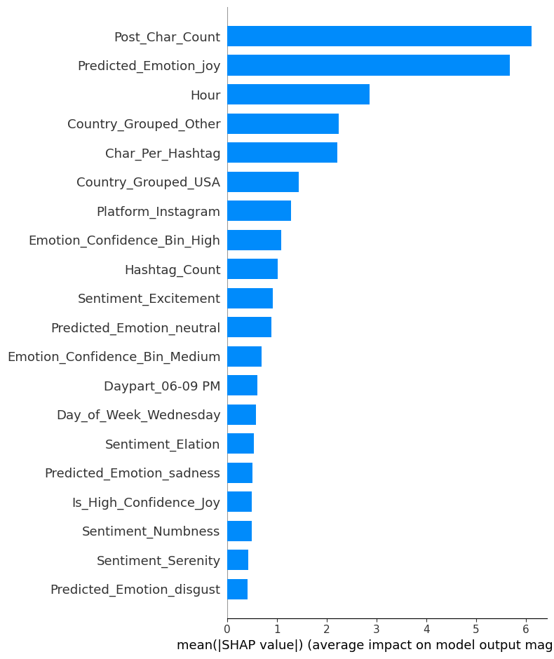
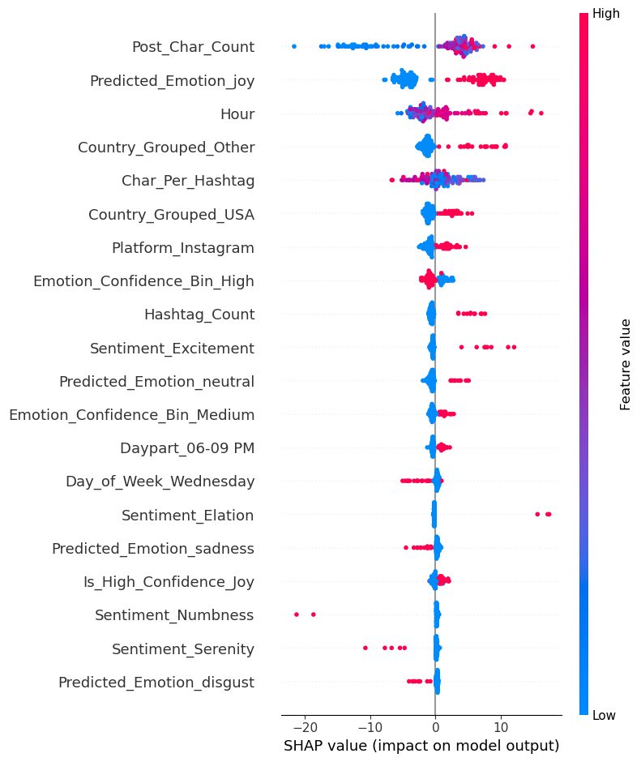
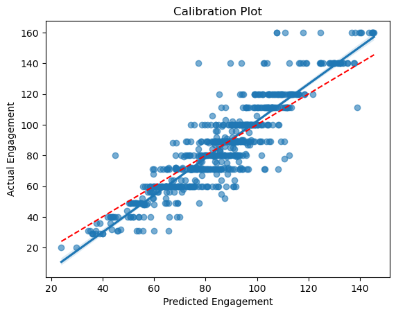
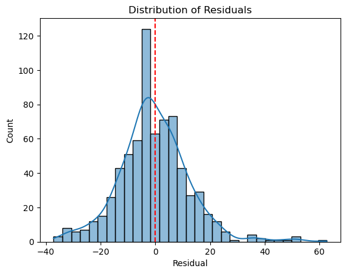
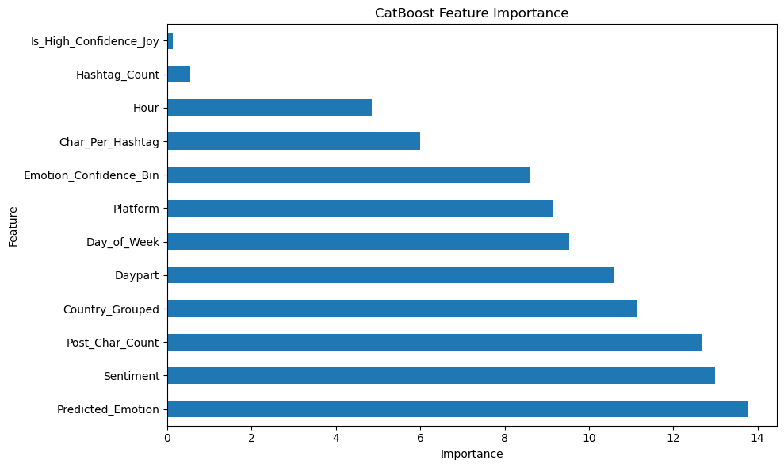

# Predictive Sentiment Analytics
This project builds a predictive model to estimate engagement scores based on emotional tone, sentiment, time of posting, and platform behavior. It includes:
- Data preprocessing and feature engineering
- Model training with XGBoost and CatBoost
- SHAP-based explainability
- Evaluation of residuals and model reliability

## Step 1: Data Cleaning and Validation


```python
import pandas as pd
import numpy as np
from sklearn.model_selection import train_test_split, RepeatedKFold, GridSearchCV
from sklearn.metrics import mean_squared_error, r2_score
from xgboost import XGBRegressor
import shap
import seaborn as sns
import matplotlib.pyplot as plt
```


```python
df = pd.read_csv("sentiment_dataset.csv")

print("Row count:", len(df))
df.info()
df.head()
```

    Row count: 732
    <class 'pandas.core.frame.DataFrame'>
    RangeIndex: 732 entries, 0 to 731
    Data columns (total 13 columns):
     #   Column     Non-Null Count  Dtype 
    ---  ------     --------------  ----- 
     0   Text       732 non-null    object
     1   Sentiment  732 non-null    object
     2   Timestamp  732 non-null    object
     3   User       732 non-null    object
     4   Platform   732 non-null    object
     5   Hashtags   732 non-null    object
     6   Retweets   732 non-null    int64 
     7   Likes      732 non-null    int64 
     8   Country    732 non-null    object
     9   Year       732 non-null    int64 
     10  Month      732 non-null    int64 
     11  Day        732 non-null    int64 
     12  Hour       732 non-null    int64 
    dtypes: int64(6), object(7)
    memory usage: 74.5+ KB
    


<div>
<style scoped>
    .dataframe tbody tr th:only-of-type {
        vertical-align: middle;
    }

    .dataframe tbody tr th {
        vertical-align: top;
    }

    .dataframe thead th {
        text-align: right;
    }
</style>
<table border="1" class="dataframe">
  <thead>
    <tr style="text-align: right;">
      <th></th>
      <th>Text</th>
      <th>Sentiment</th>
      <th>Timestamp</th>
      <th>User</th>
      <th>Platform</th>
      <th>Hashtags</th>
      <th>Retweets</th>
      <th>Likes</th>
      <th>Country</th>
      <th>Year</th>
      <th>Month</th>
      <th>Day</th>
      <th>Hour</th>
    </tr>
  </thead>
  <tbody>
    <tr>
      <th>0</th>
      <td>Enjoying a beautiful day at the park!</td>
      <td>Positive</td>
      <td>2023-01-15 12:30:00</td>
      <td>User123</td>
      <td>Twitter</td>
      <td>#Nature #Park</td>
      <td>15</td>
      <td>30</td>
      <td>USA</td>
      <td>2023</td>
      <td>1</td>
      <td>15</td>
      <td>12</td>
    </tr>
    <tr>
      <th>1</th>
      <td>Traffic was terrible this morning.</td>
      <td>Negative</td>
      <td>2023-01-15 8:45:00</td>
      <td>CommuterX</td>
      <td>Twitter</td>
      <td>#Traffic #Morning</td>
      <td>5</td>
      <td>10</td>
      <td>Canada</td>
      <td>2023</td>
      <td>1</td>
      <td>15</td>
      <td>8</td>
    </tr>
    <tr>
      <th>2</th>
      <td>Just finished an amazing workout! 💪</td>
      <td>Positive</td>
      <td>2023-01-15 15:45:00</td>
      <td>FitnessFan</td>
      <td>Instagram</td>
      <td>#Fitness #Workout</td>
      <td>20</td>
      <td>40</td>
      <td>USA</td>
      <td>2023</td>
      <td>1</td>
      <td>15</td>
      <td>15</td>
    </tr>
    <tr>
      <th>3</th>
      <td>Excited about the upcoming weekend getaway!</td>
      <td>Positive</td>
      <td>2023-01-15 18:20:00</td>
      <td>AdventureX</td>
      <td>Facebook</td>
      <td>#Travel #Adventure</td>
      <td>8</td>
      <td>15</td>
      <td>UK</td>
      <td>2023</td>
      <td>1</td>
      <td>15</td>
      <td>18</td>
    </tr>
    <tr>
      <th>4</th>
      <td>Trying out a new recipe for dinner tonight.</td>
      <td>Neutral</td>
      <td>2023-01-15 19:55:00</td>
      <td>ChefCook</td>
      <td>Instagram</td>
      <td>#Cooking #Food</td>
      <td>12</td>
      <td>25</td>
      <td>Australia</td>
      <td>2023</td>
      <td>1</td>
      <td>15</td>
      <td>19</td>
    </tr>
  </tbody>
</table>
</div>


```python
# Null check
print("\nNull values:\n", df.isnull().sum())

# Duplicate check
print("\nDuplicate rows:", df.duplicated().sum())
```

    
    Null values:
     Text         0
    Sentiment    0
    Timestamp    0
    User         0
    Platform     0
    Hashtags     0
    Retweets     0
    Likes        0
    Country      0
    Year         0
    Month        0
    Day          0
    Hour         0
    dtype: int64
    
    Duplicate rows: 21
    


```python
duplicate_rows = df[df.duplicated(keep=False)]

duplicate_rows_sorted = duplicate_rows.sort_values(by=df.columns.tolist()).reset_index(drop=True)

duplicate_rows_sorted
```


<div>
<style scoped>
    .dataframe tbody tr th:only-of-type {
        vertical-align: middle;
    }

    .dataframe tbody tr th {
        vertical-align: top;
    }

    .dataframe thead th {
        text-align: right;
    }
</style>
<table border="1" class="dataframe">
  <thead>
    <tr style="text-align: right;">
      <th></th>
      <th>Text</th>
      <th>Sentiment</th>
      <th>Timestamp</th>
      <th>User</th>
      <th>Platform</th>
      <th>Hashtags</th>
      <th>Retweets</th>
      <th>Likes</th>
      <th>Country</th>
      <th>Year</th>
      <th>Month</th>
      <th>Day</th>
      <th>Hour</th>
    </tr>
  </thead>
  <tbody>
    <tr>
      <th>0</th>
      <td>A compassionate rain, tears of empathy fallin...</td>
      <td>Compassionate</td>
      <td>2021-07-01 12:10:00</td>
      <td>RainNurturer</td>
      <td>Instagram</td>
      <td>#Compassionate #TearsOfEmpathy</td>
      <td>21</td>
      <td>42</td>
      <td>Canada</td>
      <td>2021</td>
      <td>7</td>
      <td>1</td>
      <td>12</td>
    </tr>
    <tr>
      <th>1</th>
      <td>A compassionate rain, tears of empathy fallin...</td>
      <td>Compassionate</td>
      <td>2021-07-01 12:10:00</td>
      <td>RainNurturer</td>
      <td>Instagram</td>
      <td>#Compassionate #TearsOfEmpathy</td>
      <td>21</td>
      <td>42</td>
      <td>Canada</td>
      <td>2021</td>
      <td>7</td>
      <td>1</td>
      <td>12</td>
    </tr>
    <tr>
      <th>2</th>
      <td>A free spirit soaring on the wings of dreams,...</td>
      <td>Free-spirited</td>
      <td>2020-06-10 10:05:00</td>
      <td>DreamSoarer</td>
      <td>Twitter</td>
      <td>#FreeSpirit #WingsOfDreams</td>
      <td>22</td>
      <td>44</td>
      <td>UK</td>
      <td>2020</td>
      <td>6</td>
      <td>10</td>
      <td>10</td>
    </tr>
    <tr>
      <th>3</th>
      <td>A free spirit soaring on the wings of dreams,...</td>
      <td>Free-spirited</td>
      <td>2020-06-10 10:05:00</td>
      <td>DreamSoarer</td>
      <td>Twitter</td>
      <td>#FreeSpirit #WingsOfDreams</td>
      <td>22</td>
      <td>44</td>
      <td>UK</td>
      <td>2020</td>
      <td>6</td>
      <td>10</td>
      <td>10</td>
    </tr>
    <tr>
      <th>4</th>
      <td>A playful escapade in the carnival of life, c...</td>
      <td>Playful</td>
      <td>2018-08-22 17:20:00</td>
      <td>CarnivalDreamer</td>
      <td>Facebook</td>
      <td>#Playful #CarnivalEscapade</td>
      <td>24</td>
      <td>48</td>
      <td>Australia</td>
      <td>2018</td>
      <td>8</td>
      <td>22</td>
      <td>17</td>
    </tr>
    <tr>
      <th>5</th>
      <td>A playful escapade in the carnival of life, c...</td>
      <td>Playful</td>
      <td>2018-08-22 17:20:00</td>
      <td>CarnivalDreamer</td>
      <td>Facebook</td>
      <td>#Playful #CarnivalEscapade</td>
      <td>24</td>
      <td>48</td>
      <td>Australia</td>
      <td>2018</td>
      <td>8</td>
      <td>22</td>
      <td>17</td>
    </tr>
    <tr>
      <th>6</th>
      <td>A playful escapade in the carnival of life, c...</td>
      <td>Playful</td>
      <td>2018-08-22 17:20:00</td>
      <td>CarnivalDreamer</td>
      <td>Facebook</td>
      <td>#Playful #CarnivalEscapade</td>
      <td>24</td>
      <td>48</td>
      <td>Australia</td>
      <td>2018</td>
      <td>8</td>
      <td>22</td>
      <td>17</td>
    </tr>
    <tr>
      <th>7</th>
      <td>Bathed in the golden hues of gratefulness, a ...</td>
      <td>Grateful</td>
      <td>2022-04-01 18:30:00</td>
      <td>SunsetAdmirer</td>
      <td>Instagram</td>
      <td>#Grateful #GoldenHues</td>
      <td>19</td>
      <td>38</td>
      <td>Australia</td>
      <td>2022</td>
      <td>4</td>
      <td>1</td>
      <td>18</td>
    </tr>
    <tr>
      <th>8</th>
      <td>Bathed in the golden hues of gratefulness, a ...</td>
      <td>Grateful</td>
      <td>2022-04-01 18:30:00</td>
      <td>SunsetAdmirer</td>
      <td>Instagram</td>
      <td>#Grateful #GoldenHues</td>
      <td>19</td>
      <td>38</td>
      <td>Australia</td>
      <td>2022</td>
      <td>4</td>
      <td>1</td>
      <td>18</td>
    </tr>
    <tr>
      <th>9</th>
      <td>Charting a course through the waves of hopefu...</td>
      <td>Hopeful</td>
      <td>2022-10-30 11:40:00</td>
      <td>WaveNavigator</td>
      <td>Twitter</td>
      <td>#Hopeful #SailorOfDreams</td>
      <td>17</td>
      <td>34</td>
      <td>Australia</td>
      <td>2022</td>
      <td>10</td>
      <td>30</td>
      <td>11</td>
    </tr>
    <tr>
      <th>10</th>
      <td>Charting a course through the waves of hopefu...</td>
      <td>Hopeful</td>
      <td>2022-10-30 11:40:00</td>
      <td>WaveNavigator</td>
      <td>Twitter</td>
      <td>#Hopeful #SailorOfDreams</td>
      <td>17</td>
      <td>34</td>
      <td>Australia</td>
      <td>2022</td>
      <td>10</td>
      <td>30</td>
      <td>11</td>
    </tr>
    <tr>
      <th>11</th>
      <td>Confident strides in the dance of life, a bal...</td>
      <td>Confident</td>
      <td>2021-01-15 13:00:00</td>
      <td>DanceStrider</td>
      <td>Facebook</td>
      <td>#Confident #DanceOfLife</td>
      <td>23</td>
      <td>46</td>
      <td>Canada</td>
      <td>2021</td>
      <td>1</td>
      <td>15</td>
      <td>13</td>
    </tr>
    <tr>
      <th>12</th>
      <td>Confident strides in the dance of life, a bal...</td>
      <td>Confident</td>
      <td>2021-01-15 13:00:00</td>
      <td>DanceStrider</td>
      <td>Facebook</td>
      <td>#Confident #DanceOfLife</td>
      <td>23</td>
      <td>46</td>
      <td>Canada</td>
      <td>2021</td>
      <td>1</td>
      <td>15</td>
      <td>13</td>
    </tr>
    <tr>
      <th>13</th>
      <td>Embraced by the hopeful dawn, a gardener sowi...</td>
      <td>Hopeful</td>
      <td>2022-07-17 6:15:00</td>
      <td>DawnGardener</td>
      <td>Instagram</td>
      <td>#Hopeful #SeedsOfOptimism</td>
      <td>14</td>
      <td>28</td>
      <td>UK</td>
      <td>2022</td>
      <td>7</td>
      <td>17</td>
      <td>6</td>
    </tr>
    <tr>
      <th>14</th>
      <td>Embraced by the hopeful dawn, a gardener sowi...</td>
      <td>Hopeful</td>
      <td>2022-07-17 6:15:00</td>
      <td>DawnGardener</td>
      <td>Instagram</td>
      <td>#Hopeful #SeedsOfOptimism</td>
      <td>14</td>
      <td>28</td>
      <td>UK</td>
      <td>2022</td>
      <td>7</td>
      <td>17</td>
      <td>6</td>
    </tr>
    <tr>
      <th>15</th>
      <td>Floating on clouds of inspiration, an artist ...</td>
      <td>Inspired</td>
      <td>2021-12-08 14:30:00</td>
      <td>SkyArtist</td>
      <td>Twitter</td>
      <td>#Inspired #CloudsOfCreativity</td>
      <td>18</td>
      <td>36</td>
      <td>India</td>
      <td>2021</td>
      <td>12</td>
      <td>8</td>
      <td>14</td>
    </tr>
    <tr>
      <th>16</th>
      <td>Floating on clouds of inspiration, an artist ...</td>
      <td>Inspired</td>
      <td>2021-12-08 14:30:00</td>
      <td>SkyArtist</td>
      <td>Twitter</td>
      <td>#Inspired #CloudsOfCreativity</td>
      <td>18</td>
      <td>36</td>
      <td>India</td>
      <td>2021</td>
      <td>12</td>
      <td>8</td>
      <td>14</td>
    </tr>
    <tr>
      <th>17</th>
      <td>Hopeful whispers of wind, carrying the promis...</td>
      <td>Hopeful</td>
      <td>2023-05-06 7:20:00</td>
      <td>WindWhisperer</td>
      <td>Twitter</td>
      <td>#Hopeful #BrighterTomorrows</td>
      <td>15</td>
      <td>30</td>
      <td>India</td>
      <td>2023</td>
      <td>5</td>
      <td>6</td>
      <td>7</td>
    </tr>
    <tr>
      <th>18</th>
      <td>Hopeful whispers of wind, carrying the promis...</td>
      <td>Hopeful</td>
      <td>2023-05-06 7:20:00</td>
      <td>WindWhisperer</td>
      <td>Twitter</td>
      <td>#Hopeful #BrighterTomorrows</td>
      <td>15</td>
      <td>30</td>
      <td>India</td>
      <td>2023</td>
      <td>5</td>
      <td>6</td>
      <td>7</td>
    </tr>
    <tr>
      <th>19</th>
      <td>Loneliness, a silent companion in the night, ...</td>
      <td>Loneliness</td>
      <td>2019-09-19 3:30:00</td>
      <td>NocturnalEcho</td>
      <td>Facebook</td>
      <td>#Loneliness #SolitaryNocturne</td>
      <td>18</td>
      <td>36</td>
      <td>Australia</td>
      <td>2019</td>
      <td>9</td>
      <td>19</td>
      <td>3</td>
    </tr>
    <tr>
      <th>20</th>
      <td>Loneliness, a silent companion in the night, ...</td>
      <td>Loneliness</td>
      <td>2019-09-19 3:30:00</td>
      <td>NocturnalEcho</td>
      <td>Facebook</td>
      <td>#Loneliness #SolitaryNocturne</td>
      <td>18</td>
      <td>36</td>
      <td>Australia</td>
      <td>2019</td>
      <td>9</td>
      <td>19</td>
      <td>3</td>
    </tr>
    <tr>
      <th>21</th>
      <td>Navigating the river of contentment, a serene...</td>
      <td>Contentment</td>
      <td>2019-04-27 9:50:00</td>
      <td>RiverNavigator</td>
      <td>Instagram</td>
      <td>#Contentment #TranquilWaters</td>
      <td>20</td>
      <td>40</td>
      <td>Canada</td>
      <td>2019</td>
      <td>4</td>
      <td>27</td>
      <td>9</td>
    </tr>
    <tr>
      <th>22</th>
      <td>Navigating the river of contentment, a serene...</td>
      <td>Contentment</td>
      <td>2019-04-27 9:50:00</td>
      <td>RiverNavigator</td>
      <td>Instagram</td>
      <td>#Contentment #TranquilWaters</td>
      <td>20</td>
      <td>40</td>
      <td>Canada</td>
      <td>2019</td>
      <td>4</td>
      <td>27</td>
      <td>9</td>
    </tr>
    <tr>
      <th>23</th>
      <td>Playfully juggling responsibilities, a circus...</td>
      <td>Playful</td>
      <td>2019-11-18 15:15:00</td>
      <td>JugglingArtist</td>
      <td>Instagram</td>
      <td>#Playful #JugglingResponsibilities</td>
      <td>25</td>
      <td>50</td>
      <td>USA</td>
      <td>2019</td>
      <td>11</td>
      <td>18</td>
      <td>15</td>
    </tr>
    <tr>
      <th>24</th>
      <td>Playfully juggling responsibilities, a circus...</td>
      <td>Playful</td>
      <td>2019-11-18 15:15:00</td>
      <td>JugglingArtist</td>
      <td>Instagram</td>
      <td>#Playful #JugglingResponsibilities</td>
      <td>25</td>
      <td>50</td>
      <td>USA</td>
      <td>2019</td>
      <td>11</td>
      <td>18</td>
      <td>15</td>
    </tr>
    <tr>
      <th>25</th>
      <td>Proudly scaling the peaks of achievement, a m...</td>
      <td>Proud</td>
      <td>2020-01-05 8:45:00</td>
      <td>PeakConqueror</td>
      <td>Twitter</td>
      <td>#Proud #ScalingPeaks</td>
      <td>23</td>
      <td>46</td>
      <td>USA</td>
      <td>2020</td>
      <td>1</td>
      <td>5</td>
      <td>8</td>
    </tr>
    <tr>
      <th>26</th>
      <td>Proudly scaling the peaks of achievement, a m...</td>
      <td>Proud</td>
      <td>2020-01-05 8:45:00</td>
      <td>PeakConqueror</td>
      <td>Twitter</td>
      <td>#Proud #ScalingPeaks</td>
      <td>23</td>
      <td>46</td>
      <td>USA</td>
      <td>2020</td>
      <td>1</td>
      <td>5</td>
      <td>8</td>
    </tr>
    <tr>
      <th>27</th>
      <td>Proudly scaling the peaks of achievement, a m...</td>
      <td>Proud</td>
      <td>2020-01-05 8:45:00</td>
      <td>PeakConqueror</td>
      <td>Twitter</td>
      <td>#Proud #ScalingPeaks</td>
      <td>23</td>
      <td>46</td>
      <td>USA</td>
      <td>2020</td>
      <td>1</td>
      <td>5</td>
      <td>8</td>
    </tr>
    <tr>
      <th>28</th>
      <td>Whispering tales of inspiration to the stars,...</td>
      <td>Inspired</td>
      <td>2020-08-29 20:45:00</td>
      <td>StarStoryteller</td>
      <td>Facebook</td>
      <td>#Inspired #TalesToTheStars</td>
      <td>14</td>
      <td>28</td>
      <td>UK</td>
      <td>2020</td>
      <td>8</td>
      <td>29</td>
      <td>20</td>
    </tr>
    <tr>
      <th>29</th>
      <td>Whispering tales of inspiration to the stars,...</td>
      <td>Inspired</td>
      <td>2020-08-29 20:45:00</td>
      <td>StarStoryteller</td>
      <td>Facebook</td>
      <td>#Inspired #TalesToTheStars</td>
      <td>14</td>
      <td>28</td>
      <td>UK</td>
      <td>2020</td>
      <td>8</td>
      <td>29</td>
      <td>20</td>
    </tr>
    <tr>
      <th>30</th>
      <td>With empathy as a lantern, wandering through ...</td>
      <td>Empathetic</td>
      <td>2023-09-03 21:40:00</td>
      <td>LanternWanderer</td>
      <td>Facebook</td>
      <td>#Empathetic #LanternOfCompassion</td>
      <td>16</td>
      <td>32</td>
      <td>USA</td>
      <td>2023</td>
      <td>9</td>
      <td>3</td>
      <td>21</td>
    </tr>
    <tr>
      <th>31</th>
      <td>With empathy as a lantern, wandering through ...</td>
      <td>Empathetic</td>
      <td>2023-09-03 21:40:00</td>
      <td>LanternWanderer</td>
      <td>Facebook</td>
      <td>#Empathetic #LanternOfCompassion</td>
      <td>16</td>
      <td>32</td>
      <td>USA</td>
      <td>2023</td>
      <td>9</td>
      <td>3</td>
      <td>21</td>
    </tr>
    <tr>
      <th>32</th>
      <td>Heartfelt gratitude for the laughter shared du...</td>
      <td>Gratitude</td>
      <td>2017-12-28 19:15:00</td>
      <td>FamilyGatherer</td>
      <td>Facebook</td>
      <td>#Gratitude #FamilyLaughter</td>
      <td>22</td>
      <td>45</td>
      <td>Austria</td>
      <td>2017</td>
      <td>12</td>
      <td>28</td>
      <td>19</td>
    </tr>
    <tr>
      <th>33</th>
      <td>Heartfelt gratitude for the laughter shared du...</td>
      <td>Gratitude</td>
      <td>2017-12-28 19:15:00</td>
      <td>FamilyGatherer</td>
      <td>Facebook</td>
      <td>#Gratitude #FamilyLaughter</td>
      <td>22</td>
      <td>45</td>
      <td>Austria</td>
      <td>2017</td>
      <td>12</td>
      <td>28</td>
      <td>19</td>
    </tr>
    <tr>
      <th>34</th>
      <td>Rejuvenated by the salty breeze and the sound ...</td>
      <td>Rejuvenation</td>
      <td>2021-09-20 14:30:00</td>
      <td>SeaBreezeLover</td>
      <td>Twitter</td>
      <td>#Rejuvenation #SeasideEscape</td>
      <td>18</td>
      <td>35</td>
      <td>Spain</td>
      <td>2021</td>
      <td>9</td>
      <td>20</td>
      <td>14</td>
    </tr>
    <tr>
      <th>35</th>
      <td>Rejuvenated by the salty breeze and the sound ...</td>
      <td>Rejuvenation</td>
      <td>2021-09-20 14:30:00</td>
      <td>SeaBreezeLover</td>
      <td>Twitter</td>
      <td>#Rejuvenation #SeasideEscape</td>
      <td>18</td>
      <td>35</td>
      <td>Spain</td>
      <td>2021</td>
      <td>9</td>
      <td>20</td>
      <td>14</td>
    </tr>
    <tr>
      <th>36</th>
      <td>Savoring the warmth of a cup of cocoa on a chi...</td>
      <td>Coziness</td>
      <td>2020-01-12 18:00:00</td>
      <td>WinterWarmth</td>
      <td>Instagram</td>
      <td>#Coziness #WarmWinterEvening</td>
      <td>30</td>
      <td>60</td>
      <td>Switzerland</td>
      <td>2020</td>
      <td>1</td>
      <td>12</td>
      <td>18</td>
    </tr>
    <tr>
      <th>37</th>
      <td>Savoring the warmth of a cup of cocoa on a chi...</td>
      <td>Coziness</td>
      <td>2020-01-12 18:00:00</td>
      <td>WinterWarmth</td>
      <td>Instagram</td>
      <td>#Coziness #WarmWinterEvening</td>
      <td>30</td>
      <td>60</td>
      <td>Switzerland</td>
      <td>2020</td>
      <td>1</td>
      <td>12</td>
      <td>18</td>
    </tr>
    <tr>
      <th>38</th>
      <td>Whispers of inspiration from the rustling leav...</td>
      <td>Inspiration</td>
      <td>2016-11-15 11:45:00</td>
      <td>ForestDreamer</td>
      <td>Facebook</td>
      <td>#Inspiration #ForestWhispers</td>
      <td>28</td>
      <td>55</td>
      <td>Portugal</td>
      <td>2016</td>
      <td>11</td>
      <td>15</td>
      <td>11</td>
    </tr>
    <tr>
      <th>39</th>
      <td>Whispers of inspiration from the rustling leav...</td>
      <td>Inspiration</td>
      <td>2016-11-15 11:45:00</td>
      <td>ForestDreamer</td>
      <td>Facebook</td>
      <td>#Inspiration #ForestWhispers</td>
      <td>28</td>
      <td>55</td>
      <td>Portugal</td>
      <td>2016</td>
      <td>11</td>
      <td>15</td>
      <td>11</td>
    </tr>
  </tbody>
</table>
</div>


```python
df = df.drop_duplicates().copy()
```


```python
# Strip whitespace and fix casing in key text columns
df['Platform'] = df['Platform'].str.strip().str.title()      
df['Sentiment'] = df['Sentiment'].str.strip()              
df['Country'] = df['Country'].str.strip()
df['User'] = df['User'].str.strip()
df['Hashtags'] = df['Hashtags'].str.strip()

# Confirm cleaned values
print("Platforms:", df['Platform'].unique())
print("Sentiments (sample):", df['Sentiment'].unique())
print("Countries (sample):", df['Country'].unique())
```

    Platforms: ['Twitter' 'Instagram' 'Facebook']
    Sentiments (sample): ['Positive' 'Negative' 'Neutral' 'Anger' 'Fear' 'Sadness' 'Disgust'
     'Happiness' 'Joy' 'Love' 'Amusement' 'Enjoyment' 'Admiration' 'Affection'
     'Awe' 'Disappointed' 'Surprise' 'Acceptance' 'Adoration' 'Anticipation'
     'Bitter' 'Calmness' 'Confusion' 'Excitement' 'Kind' 'Pride' 'Shame'
     'Elation' 'Euphoria' 'Contentment' 'Serenity' 'Gratitude' 'Hope'
     'Empowerment' 'Compassion' 'Tenderness' 'Arousal' 'Enthusiasm'
     'Fulfillment' 'Reverence' 'Despair' 'Grief' 'Loneliness' 'Jealousy'
     'Resentment' 'Frustration' 'Boredom' 'Anxiety' 'Intimidation'
     'Helplessness' 'Envy' 'Regret' 'Curiosity' 'Indifference' 'Numbness'
     'Melancholy' 'Nostalgia' 'Ambivalence' 'Determination' 'Zest' 'Hopeful'
     'Proud' 'Grateful' 'Empathetic' 'Compassionate' 'Playful' 'Free-spirited'
     'Inspired' 'Confident' 'Bitterness' 'Yearning' 'Fearful' 'Apprehensive'
     'Overwhelmed' 'Jealous' 'Devastated' 'Frustrated' 'Envious' 'Dismissive'
     'Thrill' 'Bittersweet' 'Overjoyed' 'Inspiration' 'Motivation'
     'Contemplation' 'JoyfulReunion' 'Satisfaction' 'Blessed' 'Reflection'
     'Appreciation' 'Confidence' 'Accomplishment' 'Wonderment' 'Optimism'
     'Enchantment' 'Intrigue' 'PlayfulJoy' 'Mindfulness' 'DreamChaser'
     'Elegance' 'Whimsy' 'Pensive' 'Harmony' 'Creativity' 'Radiance' 'Wonder'
     'Rejuvenation' 'Coziness' 'Adventure' 'Melodic' 'FestiveJoy'
     'InnerJourney' 'Freedom' 'Dazzle' 'Adrenaline' 'ArtisticBurst'
     'CulinaryOdyssey' 'Resilience' 'Immersion' 'Spark' 'Marvel' 'Heartbreak'
     'Betrayal' 'Suffering' 'EmotionalStorm' 'Isolation' 'Disappointment'
     'LostLove' 'Exhaustion' 'Sorrow' 'Darkness' 'Desperation' 'Ruins'
     'Desolation' 'Loss' 'Heartache' 'Solitude' 'Positivity' 'Kindness'
     'Friendship' 'Success' 'Exploration' 'Amazement' 'Romance' 'Captivation'
     'Tranquility' 'Grandeur' 'Emotion' 'Energy' 'Celebration' 'Charm'
     'Ecstasy' 'Colorful' 'Hypnotic' 'Connection' 'Iconic' 'Journey'
     'Engagement' 'Touched' 'Suspense' 'Triumph' 'Heartwarming' 'Obstacle'
     'Sympathy' 'Pressure' 'Renewed Effort' 'Miscalculation' 'Challenge'
     'Solace' 'Breakthrough' 'Joy in Baking' 'Envisioning History'
     'Imagination' 'Vibrancy' 'Mesmerizing' 'Culinary Adventure'
     'Winter Magic' 'Thrilling Journey' "Nature's Beauty" 'Celestial Wonder'
     'Creative Inspiration' 'Runway Creativity' "Ocean's Freedom"
     'Whispers of the Past' 'Relief' 'Embarrassed' 'Mischievous' 'Sad' 'Hate'
     'Bad' 'Happy']
    Countries (sample): ['USA' 'Canada' 'UK' 'Australia' 'India' 'France' 'Brazil' 'Japan'
     'Greece' 'Germany' 'Sweden' 'Italy' 'Netherlands' 'South Africa' 'Spain'
     'Portugal' 'Switzerland' 'Austria' 'Belgium' 'Denmark' 'Czech Republic'
     'Jordan' 'Peru' 'Maldives' 'China' 'Cambodia' 'Norway' 'Colombia'
     'Ireland' 'Jamaica' 'Kenya' 'Scotland' 'Thailand']
    


```python
# Check for negative or zero engagement
print("Negative likes:", df[df['Likes'] < 0].shape[0])
print("Negative retweets:", df[df['Retweets'] < 0].shape[0])
print("Zero engagement rows:", df[(df['Likes'] == 0) & (df['Retweets'] == 0)].shape[0])

# Timestamps far in the future (let's say post-2025)
df['Timestamp'] = pd.to_datetime(df['Timestamp'])  # ensure proper datetime format
future_dates = df[df['Timestamp'] > '2025-01-01']
print("Future-dated rows:", future_dates.shape[0])

# Validate hour values (should be 0–23)
invalid_hours = df[~df['Hour'].between(0, 23)]
print("Invalid hour values:", invalid_hours.shape[0])

# Check absurdly high likes/retweets
print("Max Likes:", df['Likes'].max())
print("Max Retweets:", df['Retweets'].max())
```

    Negative likes: 0
    Negative retweets: 0
    Zero engagement rows: 0
    Future-dated rows: 0
    Invalid hour values: 0
    Max Likes: 80
    Max Retweets: 40
    


```python
duplicate_posts = df[df.duplicated(subset=['User', 'Timestamp', 'Text'], keep=False)]

print("Duplicate posts with differing data:\n", duplicate_posts)
```

    Duplicate posts with differing data:
                                                       Text      Sentiment  \
    264   A compassionate rain, tears of empathy fallin...  Compassionate   
    266   Embraced by the hopeful dawn, a gardener sowi...        Hopeful   
    278   A compassionate rain, tears of empathy fallin...  Compassionate   
    294   Embraced by the hopeful dawn, a gardener sowi...        Hopeful   
    308   Shattered dreams lie on the floor like fragme...     Frustrated   
    330   Shattered dreams lie on the floor like fragme...     Frustrated   
    
                  Timestamp          User   Platform  \
    264 2021-07-01 12:10:00  RainNurturer   Facebook   
    266 2022-07-17 06:15:00  DawnGardener  Instagram   
    278 2021-07-01 12:10:00  RainNurturer  Instagram   
    294 2022-07-17 06:15:00  DawnGardener  Instagram   
    308 2022-01-07 11:10:00   DreamMosaic  Instagram   
    330 2022-01-07 11:10:00   DreamMosaic    Twitter   
    
                                    Hashtags  Retweets  Likes Country  Year  ...  \
    264       #Compassionate #TearsOfEmpathy        21     42  Canada  2021  ...   
    266            #Hopeful #SeedsOfOptimism        14     28      UK  2022  ...   
    278       #Compassionate #TearsOfEmpathy        21     42  Canada  2021  ...   
    294            #Hopeful #SeedsOfOptimism        14     28   India  2022  ...   
    308  #Frustrated #MosaicOfDisappointment        15     30  Canada  2022  ...   
    330  #Frustrated #MosaicOfDisappointment        15     30  Canada  2022  ...   
    
         Country_Grouped  Emotion_Confidence_Bin  Hashtag_Count Day_of_Week  \
    264            Other                  Medium              0    Thursday   
    266               UK                    High              0      Sunday   
    278            Other                  Medium              0    Thursday   
    294            Other                    High              0      Sunday   
    308            Other                  Medium              0      Friday   
    330            Other                  Medium              0      Friday   
    
         Post_Char_Count  Post_Length_Bin Char_Per_Hashtag Is_High_Confidence_Joy  \
    264              124             Long            124.0                      0   
    266              114             Long            114.0                      1   
    278              124             Long            124.0                      0   
    294              114             Long            114.0                      1   
    308              124             Long            124.0                      0   
    330              124             Long            124.0                      0   
    
        Predicted_Engagement   Residual  
    264            87.888535  -3.888535  
    266            58.686314  -2.686314  
    278            89.760590  -5.760590  
    294            61.880634  -5.880634  
    308            70.763756 -10.763756  
    330            69.580490  -9.580490  
    
    [6 rows x 27 columns]
    


```python
df = df.drop_duplicates(subset=['User', 'Text', 'Timestamp'], keep='first').copy()

print("Row count after deduplication:", len(df))
```

    Row count after deduplication: 708
    

## Step 2: Feature Engineering


```python
# Sentiment Segmentation
from transformers import AutoTokenizer, AutoModelForSequenceClassification, pipeline
import pandas as pd

# Load model and tokenizer
model_name = "j-hartmann/emotion-english-distilroberta-base"
tokenizer = AutoTokenizer.from_pretrained(model_name)
model = AutoModelForSequenceClassification.from_pretrained(model_name)

# Create the emotion classification pipeline
emotion_classifier = pipeline("text-classification", model=model, tokenizer=tokenizer, top_k=None)

# Define classification function
def classify_text_goemotions(text):
    try:
        results = emotion_classifier(str(text))[0]  # Get full list of emotions
        top = max(results, key=lambda x: x['score'])  # Pick the one with the highest score
        return pd.Series([top['label'], round(top['score'], 4)])
    except Exception as e:
        return pd.Series([None, None])  # Handle errors gracefully

# Apply to your DataFrame
df[['Predicted_Emotion', 'Emotion_Score']] = df['Text'].apply(classify_text_goemotions)
```

    E:\My Data\8. Computer System\Computer\- Setup Files -\anaconda\Lib\site-packages\huggingface_hub\file_download.py:896: FutureWarning: `resume_download` is deprecated and will be removed in version 1.0.0. Downloads always resume when possible. If you want to force a new download, use `force_download=True`.
      warnings.warn(
    


```python
print(df[['Predicted_Emotion', 'Emotion_Score']].isnull().sum())
print(df['Predicted_Emotion'].value_counts().head())
print("Highest confidence:", df['Emotion_Score'].max())
print("Lowest confidence:", df['Emotion_Score'].min())
```

    Predicted_Emotion    0
    Emotion_Score        0
    dtype: int64
    Predicted_Emotion
    joy        281
    fear       145
    sadness     97
    neutral     88
    disgust     53
    Name: count, dtype: int64
    Highest confidence: 0.9953
    Lowest confidence: 0.2341
    


```python
# Create Target - Engagement Score
df['Engagement_Score'] = df['Likes'] + (2 * df['Retweets'])

# Create Daypart Column
def get_daypart_3hr_am_pm(hour):
    if 0 <= hour < 3:
        return '12-03 AM'
    elif 3 <= hour < 6:
        return '03-06 AM'
    elif 6 <= hour < 9:
        return '06-09 AM'
    elif 9 <= hour < 12:
        return '09-12 AM'
    elif 12 <= hour < 15:
        return '12-03 PM'
    elif 15 <= hour < 18:
        return '03-06 PM'
    elif 18 <= hour < 21:
        return '06-09 PM'
    else:
        return '09-12 PM'

df['Daypart'] = df['Hour'].apply(get_daypart_3hr_am_pm)

# Group Rare Countries 
country_counts = df['Country'].value_counts()
min_threshold = 20
common_countries = country_counts[country_counts >= min_threshold].index
df['Country_Grouped'] = df['Country'].apply(lambda x: x if x in common_countries else 'Other')

# Bin Emotion Score 
emotion_bins = [0, 0.5, 0.75, 1.0]
emotion_labels = ['Low', 'Medium', 'High']
df['Emotion_Confidence_Bin'] = pd.cut(df['Emotion_Score'], bins=emotion_bins, labels=emotion_labels, include_lowest=True)

# Count hashtags in each post (words starting with #)
import re
df['Hashtag_Count'] = df['Text'].apply(lambda x: len(re.findall(r'#\w+', str(x))))

# Create Day of Week
df['Timestamp'] = pd.to_datetime(df['Timestamp'])
df['Day_of_Week'] = df['Timestamp'].dt.day_name()

# Create Post Character Count
df['Post_Char_Count'] = df['Text'].astype(str).apply(len)

# Bin Post Length by Character Count
bins = [0, 60, 100, float('inf')]
labels = ['Short', 'Medium', 'Long']
df['Post_Length_Bin'] = pd.cut(df['Post_Char_Count'], bins=bins, labels=labels)
```

## 3: Modeling and Evaluation

### 3.1: Split, Encode, and Align


```python
# Create Interaction Features
df['Char_Per_Hashtag'] = df['Post_Char_Count'] / (df['Hashtag_Count'] + 1)
df['Is_High_Confidence_Joy'] = ((df['Predicted_Emotion'] == 'joy') & (df['Emotion_Confidence_Bin'] == 'High')).astype(int)

# Define Features and Target
features = [
    'Predicted_Emotion', 'Emotion_Confidence_Bin', 'Sentiment',
    'Hashtag_Count', 'Post_Char_Count', 'Char_Per_Hashtag', 'Is_High_Confidence_Joy',
    'Platform', 'Country_Grouped', 'Daypart', 'Hour', 'Day_of_Week'
]
target = 'Engagement_Score'

X = df[features]
y = df[target]

# Train-Test Split
from sklearn.model_selection import train_test_split
X_train, X_test, y_train, y_test = train_test_split(X, y, test_size=0.2, random_state=42)

# One-Hot Encode
X_train_encoded = pd.get_dummies(X_train, drop_first=True)
X_test_encoded = pd.get_dummies(X_test, drop_first=True)

# Align Columns
X_train_encoded, X_test_encoded = X_train_encoded.align(X_test_encoded, join='left', axis=1, fill_value=0)
```

### 3.2: XGBoost GridSearch


```python
# Model and Grid Setup
from xgboost import XGBRegressor
from sklearn.model_selection import GridSearchCV, RepeatedKFold
from sklearn.metrics import mean_squared_error, r2_score

param_grid = {
    'n_estimators': [300, 400, 500],
    'max_depth': [5, 6, 7],
    'learning_rate': [0.005, 0.01, 0.02],
    'subsample': [0.7, 0.8, 0.9],
    'colsample_bytree': [0.7, 0.8, 0.9]
}

xgb_reg = XGBRegressor(objective='reg:squarederror', random_state=42)

grid_search = GridSearchCV(
    estimator=xgb_reg,
    param_grid=param_grid,
    scoring='r2',
    cv=RepeatedKFold(n_splits=5, n_repeats=3, random_state=42),
    n_jobs=-1,
    verbose=1
)

# Train Model
grid_search.fit(X_train_encoded, y_train)

# Evaluate
best_model = grid_search.best_estimator_
y_pred = best_model.predict(X_test_encoded)

mse = mean_squared_error(y_test, y_pred)
r2 = r2_score(y_test, y_pred)

print("Best Parameters:", grid_search.best_params_)
print(f"Test Mean Squared Error: {mse:.2f}")
print(f"Test R² Score: {r2:.4f}")
```

    Fitting 15 folds for each of 243 candidates, totalling 3645 fits
    Best Parameters: {'colsample_bytree': 0.7, 'learning_rate': 0.02, 'max_depth': 7, 'n_estimators': 500, 'subsample': 0.9}
    Test Mean Squared Error: 493.73
    Test R² Score: 0.3576
    

### 3.3: SHAP Explanation


```python
import shap

# Initialize SHAP JS
shap.initjs()

# Create TreeExplainer
explainer = shap.Explainer(best_model)

# Run SHAP on a sample 
X_sample = X_test_encoded.copy()
shap_values = explainer(X_sample)

# SHAP Summary Bar Plot 
shap.summary_plot(shap_values, X_sample, plot_type="bar")

# SHAP Beeswarm Plot 
shap.summary_plot(shap_values, X_sample)

# Predict on full dataset
X_encoded_full = pd.get_dummies(X[features], drop_first=True)
X_encoded_full = X_encoded_full.reindex(columns=X_train_encoded.columns, fill_value=0)
df['Predicted_Engagement'] = best_model.predict(X_encoded_full)
```


    

    


    

    


### 3.4: Model Reliability & Calibration


```python
df['Predicted_Engagement'] = best_model.predict(pd.get_dummies(X, drop_first=True).reindex(columns=X_train_encoded.columns, fill_value=0))
df['Residual'] = df['Engagement_Score'] - df['Predicted_Engagement']

# Correlation
correlation = df[['Engagement_Score', 'Predicted_Engagement']].corr().iloc[0, 1]
print(f"Correlation between actual and predicted engagement: {correlation:.2f}")
```

    Correlation between actual and predicted engagement: 0.91
    

### 3.5: Diagnostic Plots


```python
import seaborn as sns
import matplotlib.pyplot as plt

# Calibration plot
sns.regplot(data=df, x='Predicted_Engagement', y='Engagement_Score', scatter_kws={'alpha':0.6})
plt.plot([df['Predicted_Engagement'].min(), df['Predicted_Engagement'].max()],
         [df['Predicted_Engagement'].min(), df['Predicted_Engagement'].max()],
         'r--')
plt.title("Calibration Plot")
plt.xlabel("Predicted Engagement")
plt.ylabel("Actual Engagement")
plt.show()

# Residuals distribution
sns.histplot(df['Residual'], kde=True)
plt.axvline(0, color='red', linestyle='--')
plt.title("Distribution of Residuals")
plt.xlabel("Residual")
plt.ylabel("Count")
plt.show()
```


    

    


    

    


```python
from catboost import CatBoostRegressor, Pool

# Prepare data
features = [
    'Predicted_Emotion', 'Emotion_Confidence_Bin', 'Sentiment',
    'Hashtag_Count', 'Post_Char_Count', 'Char_Per_Hashtag', 'Is_High_Confidence_Joy',
    'Platform', 'Country_Grouped', 'Daypart', 'Hour', 'Day_of_Week'
]
target = 'Engagement_Score'

X = df[features]
y = df[target]
X_train, X_test, y_train, y_test = train_test_split(X, y, test_size=0.2, random_state=42)

categorical_features = [
    'Predicted_Emotion', 'Emotion_Confidence_Bin', 'Sentiment',
    'Platform', 'Country_Grouped', 'Daypart', 'Day_of_Week'
]

# CatBoost model with smarter tuning
cat_model = CatBoostRegressor(
    iterations=1500,
    learning_rate=0.02,
    depth=8,
    l2_leaf_reg=5,
    bagging_temperature=0.5,
    loss_function='RMSE',
    eval_metric='R2',
    cat_features=categorical_features,
    early_stopping_rounds=100,
    verbose=100,
    random_seed=42
)

cat_model.fit(X_train, y_train, eval_set=(X_test, y_test), use_best_model=True)

# Evaluate
y_pred = cat_model.predict(X_test)
mse = mean_squared_error(y_test, y_pred)
r2 = r2_score(y_test, y_pred)

print(f"Test MSE: {mse:.2f}")
print(f"Test R² Score: {r2:.4f}")
```

    0:	learn: 0.0066963	test: 0.0006520	best: 0.0006520 (0)	total: 33.5ms	remaining: 50.2s
    100:	learn: 0.3763247	test: 0.2409629	best: 0.2409629 (100)	total: 3.22s	remaining: 44.7s
    200:	learn: 0.5255300	test: 0.2962932	best: 0.2962932 (200)	total: 6.56s	remaining: 42.4s
    300:	learn: 0.6016867	test: 0.3098438	best: 0.3098438 (300)	total: 9.34s	remaining: 37.2s
    400:	learn: 0.6488083	test: 0.3164053	best: 0.3165283 (397)	total: 12.2s	remaining: 33.5s
    500:	learn: 0.6850183	test: 0.3267883	best: 0.3269509 (499)	total: 15.6s	remaining: 31.1s
    600:	learn: 0.7154044	test: 0.3348304	best: 0.3348304 (600)	total: 19.2s	remaining: 28.8s
    700:	learn: 0.7468371	test: 0.3412471	best: 0.3414205 (684)	total: 22.9s	remaining: 26.1s
    800:	learn: 0.7802647	test: 0.3453623	best: 0.3460030 (764)	total: 26.3s	remaining: 23s
    900:	learn: 0.8083125	test: 0.3508223	best: 0.3513531 (886)	total: 29.6s	remaining: 19.7s
    1000:	learn: 0.8323656	test: 0.3551552	best: 0.3554711 (979)	total: 33.1s	remaining: 16.5s
    1100:	learn: 0.8511045	test: 0.3585505	best: 0.3589872 (1094)	total: 36.5s	remaining: 13.2s
    1200:	learn: 0.8668306	test: 0.3590335	best: 0.3598315 (1165)	total: 39.9s	remaining: 9.94s
    Stopped by overfitting detector  (100 iterations wait)
    
    bestTest = 0.3598314818
    bestIteration = 1165
    
    Shrink model to first 1166 iterations.
    Test MSE: 491.98
    Test R² Score: 0.3598
    


```python

df_catboost = df.copy()
df_catboost['Predicted_Engagement_CatBoost'] = cat_model.predict(df[features])

# Compute correlation between actual and predicted engagement
correlation = df_catboost[['Engagement_Score', 'Predicted_Engagement_CatBoost']].corr().iloc[0, 1]

print(f"Correlation between actual and predicted engagement (CatBoost): {correlation:.2f}")
```

    Correlation between actual and predicted engagement (CatBoost): 0.80
    


```python
import matplotlib.pyplot as plt

feature_importance = cat_model.get_feature_importance(prettified=True)
feature_importance.plot(kind='barh', x='Feature Id', y='Importances', figsize=(10, 6), legend=False)
plt.title("CatBoost Feature Importance")
plt.xlabel("Importance")
plt.ylabel("Feature")
plt.tight_layout()
plt.show()
```


    

    


# Final Takeways

This project explored predictive modeling for social media engagement using emotional tone, behavioral traits, and post metadata. After thorough preprocessing and feature engineering—including sentiment segmentation, confidence binning, and interaction metrics—we trained and evaluated both XGBoost and CatBoost regressors.

Despite the CatBoost model yielding a slightly higher R² score (0.3598) and lower test MSE (491.98), the XGBoost model demonstrated a stronger correlation (0.91) between predicted and actual engagement than CatBoost (0.80), suggesting it captured the directional patterns of engagement more reliably.

I tested multiple tuning strategies, including regularization, boosting iterations, and categorical encoding, and even optimized CatBoost for automatic handling of categorical features. While both models performed comparably, XGBoost emerged as the more stable predictor in this context. This model demonstrates the viability of using emotional tone, sentiment, and post timing to predict social media engagement. While the dataset lacked platform-specific metrics, it still showed that content characteristics and emotion signals can be strong predictors of engagement performance.

Future improvements could include incorporating follower count, content type, media presence (image/video), or platform algorithm behavior—all likely to add explanatory power. Overall, the project demonstrates how blending emotional and behavioral signals can yield reliable engagement forecasting foundations in social content strategy.

